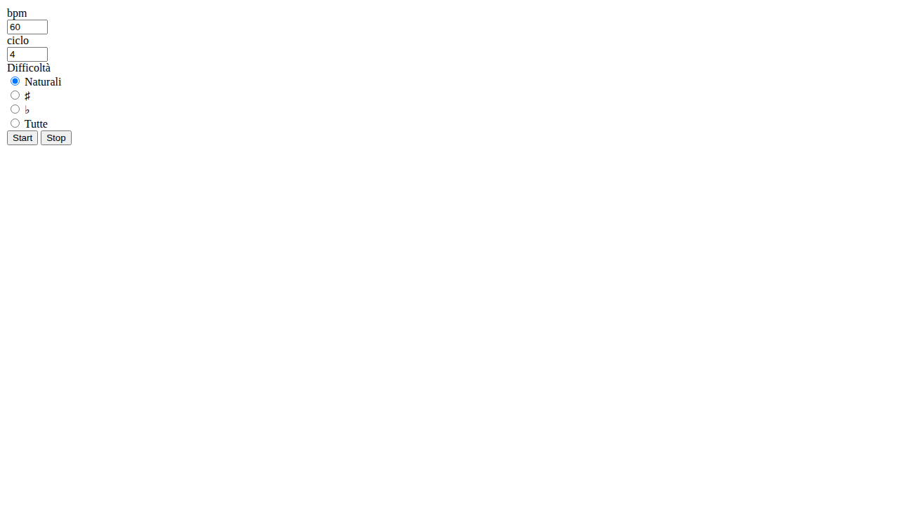

# Bass Ass 🎸

Un'applicazione web per l'allenamento al basso che combina un metronomo con la visualizzazione casuale di note musicali.

## 📝 Descrizione

Bass Ass è uno strumento di pratica per bassisti che aiuta a migliorare la tecnica e la conoscenza delle note sulla tastiera. L'applicazione riproduce un metronomo a BPM configurabile e mostra note musicali casuali da suonare, con diversi livelli di difficoltà.

## ✨ Funzionalità

- **Metronomo regolabile**: Imposta i BPM (battiti per minuto) da 1 a infinito
- **Ciclo personalizzabile**: Definisci quanti battiti prima di cambiare nota
- **Livelli di difficoltà**:
  - **Naturali**: Solo note naturali (C, D, E, F, G, A, B)
  - **Diesis**: Note naturali + diesis (C♯, D♯, F♯, G♯, A♯)
  - **Bemolle**: Note naturali + bemolle (D♭, E♭, G♭, A♭, B♭)
  - **Tutte**: Tutte le note (naturali, diesis e bemolle)
- **Contatore visivo**: Mostra il battito corrente nel ciclo
- **Audio feedback**: Suono del metronomo per ogni battito

## 🚀 Come Usare

1. Apri `index.html` nel tuo browser web
2. Imposta i parametri:
   - **BPM**: Velocità del metronomo (default: 60)
   - **Ciclo**: Numero di battiti prima di cambiare nota (default: 4)
   - **Difficoltà**: Seleziona il tipo di note da visualizzare
3. Clicca su **Start** per iniziare la sessione di pratica
4. Suona le note visualizzate sul tuo basso seguendo il metronomo
5. Clicca su **Stop** per terminare

## 🛠️ Tecnologie

- HTML5
- JavaScript (jQuery)
- Bootstrap 3.4.1
- Web Audio API

## 📁 Struttura del Progetto

```
bass-ass/
├── index.html          # Pagina principale dell'applicazione
├── js/
│   └── scripts.js      # Logica dell'applicazione
├── resources/
│   ├── MetroBar1.wav   # Suono metronomo (battuta)
│   └── MetroBeat1.wav  # Suono metronomo (battito)
└── README.md           # Questo file
```

## 💡 Suggerimenti per la Pratica

1. **Inizia lento**: Comincia con un BPM basso (40-60) per concentrarti sulla precisione
2. **Aumenta gradualmente**: Man mano che migliori, aumenta i BPM
3. **Varia la difficoltà**: Inizia con note naturali, poi aggiungi diesis e bemolle
4. **Pratica regolare**: Sessioni brevi ma frequenti sono più efficaci di sessioni lunghe sporadiche

## 📸 Screenshot



## 📄 Licenza

Questo progetto è open source e disponibile per chiunque voglia migliorare le proprie abilità al basso!

## 🤝 Contributi

Contributi, suggerimenti e segnalazioni di bug sono benvenuti!

---

**Buona pratica! 🎵**
